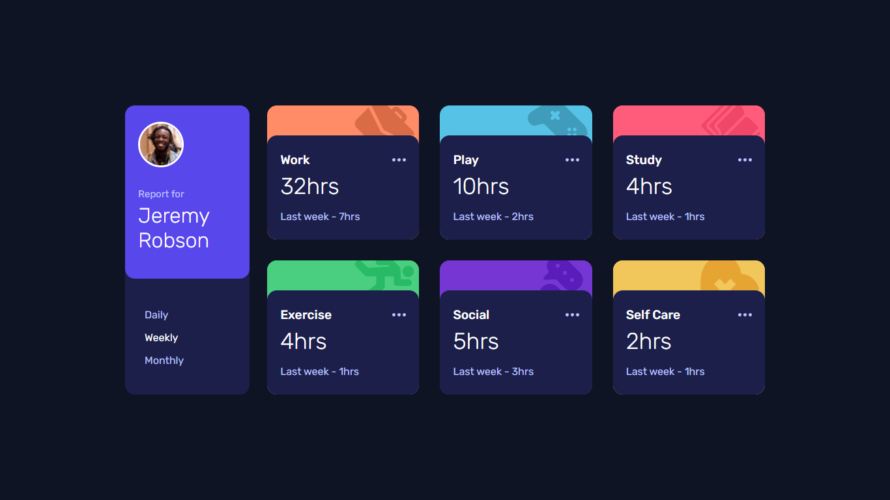
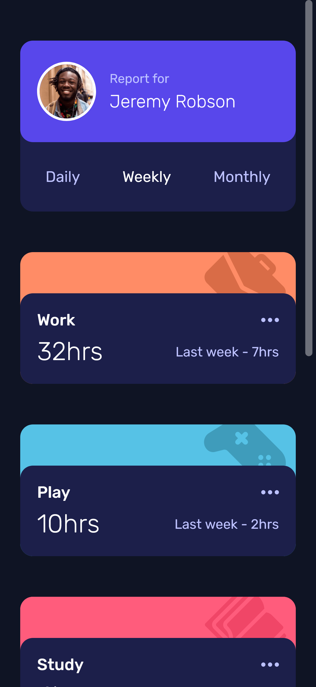

# Frontend Mentor - Time tracking dashboard solution

This is a solution to the [Time tracking dashboard challenge on Frontend Mentor](https://www.frontendmentor.io/challenges/time-tracking-dashboard-UIQ7167Jw). Frontend Mentor challenges help you improve your coding skills by building realistic projects.

## Table of contents

- [Overview](#overview)
  - [The challenge](#the-challenge)
  - [Screenshot](#screenshot)
  - [Links](#links)
- [My process](#my-process)
  - [Built with](#built-with)
  - [What I learned](#what-i-learned)
  - [Continued development](#continued-development)
  - [Useful resources](#useful-resources)
- [Author](#author)

## Overview

### The challenge

Users should be able to:

- View the optimal layout for the site depending on their device's screen size
- See hover states for all interactive elements on the page
- Switch between viewing Daily, Weekly, and Monthly stats

### Screenshot

### Links

- Solution URL: [Time-Tracking-Dashboard-Github](https://your-solution-url.com)
- Live Site URL: [Time-Tracking-Dashboard](https://create-react-app-two-sand.vercel.app/)

## My process

Breaking Down the design into components and creating components.
Using useState to render conditionaly by listening click event.

### Built with

- Semantic HTML5 markup
- CSS custom properties
- Flexbox
- CSS Grid
- Mobile-first workflow
- [React](https://reactjs.org/) - JS library

### What I learned

I learned the following things about ReactJS:

- Breaking Down into components
- Custom Tags, props
- Hook useState
- Css Module

## Author

- Frontend Mentor - [@MohtashimAli85](https://www.frontendmentor.io/profile/MohtashimAli85)
- LinkedIn - [@yourusername](https://www.linkedin.com/in/mohtashim-ali-698720194/)
